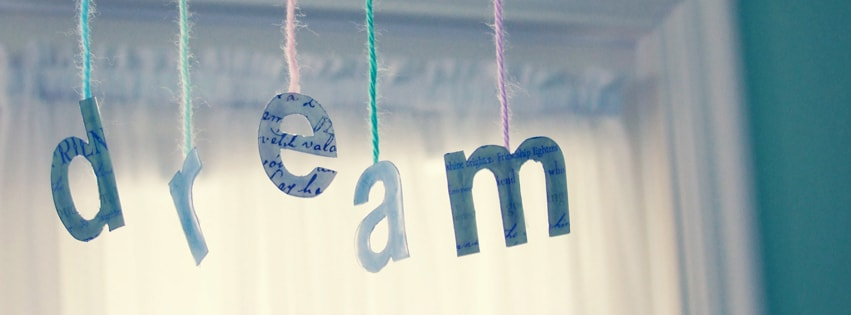

Welcome to the **Dream** team's README! We are a group of six enthusiastic girls who are passionate about learning and sharing knowledge in the world of coding.

## Meet the Team

- **Name**
  - :octocat: **GitHub:** [GitHub Profile](URL)
  - :thought_balloon: **Why I'm Doing the Course:** *I believe...*
  - :star2: **Favorite Topic:** ***example*** - *Reason*
  - :plate_with_cutlery: **Favorite Food:** 

- **Nasra Hussein**
  - :octocat: **GitHub:** [@NasraHussein3](https://github.com/NasraHussein3)
  - :thought_balloon: **Why I'm Doing the Course:** *I love everything Front-end web development and I know CFG will help me excelle in this*
  - :star2: **Favorite Topic:** ***Javascript*** 
  - :plate_with_cutlery: **Favorite Food:** *Concrete cake with custard*

- **Name**
  - :octocat: **GitHub:** [GitHub Profile](URL)
  - :thought_balloon: **Why I'm Doing the Course:** *Because...*
  - :star2: **Favorite Topic:** ***example*** - *Reason*
  - :plate_with_cutlery: **Favorite Food:**

- **Name**
  - :octocat: **GitHub:** [GitHub Profile](URL)
  - :thought_balloon: **Why I'm Doing the Course:** *...*
  - :star2: **Favorite Topic:** ***example*** - *Reason*
  - :plate_with_cutlery: **Favorite Food:** 

- **Name**
  - :octocat: **GitHub:** [GitHub Profile](URL)
  - :thought_balloon: **Why I'm Doing the Course:** *I believe...*
  - :star2: **Favorite Topic:** ***example*** - *Reason*
  - :plate_with_cutlery: **Favorite Food:**

- **Remi - Rongrong**
  - :octocat: **GitHub:** [@sherlkk](https://github.com/sherlkk)
  - :thought_balloon: **Why I'm Doing the Course:** *I believe that in our rapidly advancing digital world, coding is the key to unlocking limitless opportunities for problem-solving, creativity, and making a positive impact on society.*
  - :star2: **Favorite Topic:** ***Machine Learning*** - *I love exploring the endless possibilities.*
  - :plate_with_cutlery: **Favorite Food:** *Potato* :potato: *Ice Cream* :ice_cream: *Chips* :fries: *Popcorn* :popcorn:

## Our Focus

As a team, we are dedicated to becoming full-stack developers. Our journey encompasses both front-end and back-end development, and we aim to create complete, user-friendly web applications.

## Our Slogan

***"Coding Dreams into Reality"***

We are not just dreamers; we are doers. Together, we transform our coding dreams into reality!

